<h1 align="center">
   
</h1>

<h4 align="center"> 
	Radar Peçonhento
</h4>

## ✅ Funções

- <h3>ADMINISTRAÇÃO</h3>
    - [x] GERENCIAMENTO DE ACIDENTES
    - [x] GERENCIAMENTO DE ANIMAIS
        - [X] CRIAR
            - [X] CRIAR CAMADAS DE ACIDENTE
        - [x] ATUALIZAR
        - [x] DELETAR
        - [x] LISTAR
        - [x] PESQUISAR
        - [x] ENVIAR FOTO
    - [x] GERENCIAMENTO DE CATEGORIAS

- <h3>ADMINISTRAÇÃO DE USUÁRIOS</h3>
    - [x] GERENCIAMENTO DE USUÁRIOS
    - [x] GERENCIAMENTO DE GRUPOS
    - [x] GERENCIAMENTO DE PERMISSÕES

## 📚 Descrição

- Desenvolvido inicialmente como um manual, este projeto foi transformado em um avançado Sistema de Informação como parte da dissertação de mestrado de Henrick de Sousa Nogueira, no Programa de Pós-Graduação em Computação Aplicada da Universidade Federal do Pará (UFPA). O sistema integra tecnologias de ponta em Banco de Dados Relacional com MySQL, programação Back-End em Java utilizando Spring Boot e REST API, além de inovações em Visão Computacional e Deep Learning com Python, TensorFlow, OpenCV e Keras. Complementarmente, a interface do usuário é desenvolvida em Vue.js para a web e Flutter para aplicativos móveis, disponíveis tanto para Android quanto para iOS.
- A funcionalidade principal do sistema é a informatização do conteúdo do antigo manual para facilitar a identificação de Radar Peçonhento. Uma característica destacada é a capacidade de os usuários enviarem fotos de animais via aplicativo móvel para o servidor. Lá, a imagem é processada por um script Python que utiliza um modelo de rede neural convolucional treinado para reconhecer o animal. Após o reconhecimento, o sistema fornece informações detalhadas sobre o animal identificado, incluindo o nível de gravidade do acidente, possíveis sintomas, exames laboratoriais recomendados e tratamentos apropriados.
- Este sistema não apenas moderniza a identificação de Radar Peçonhento, mas também contribui significativamente para a segurança e educação ambiental na região amazônica.

## 🛠 Tecnologias

As seguintes ferramentas foram usadas na construção do projeto:

- [Vue.js (v5.0.8)](https://vuejs.org/)
- [Node.js (v20.11.0)](https://nodejs.org/en)
- [NPM (v10.2.4)](https://www.npmjs.com/)
- [HTML5](https://www.w3schools.com/html/default.asp)
-  [CSS 3](https://www.w3schools.com/css/)
-  [JavaScript](https://developer.mozilla.org/pt-BR/docs/Web/JavaScript)

## Commands

#### Construir a Imagem

```
docker build -t doe-ui --build-arg NEXT_PUBLIC_BASE_URL=http://localhost:8080 .
```

#### Levantar o container da api

```
docker run -p 3000:3000 --env-file .env.local doe-ui
```

## 📱 Plataforma adotada

- Web;

## 📸 Screenshot

<p float="left">
	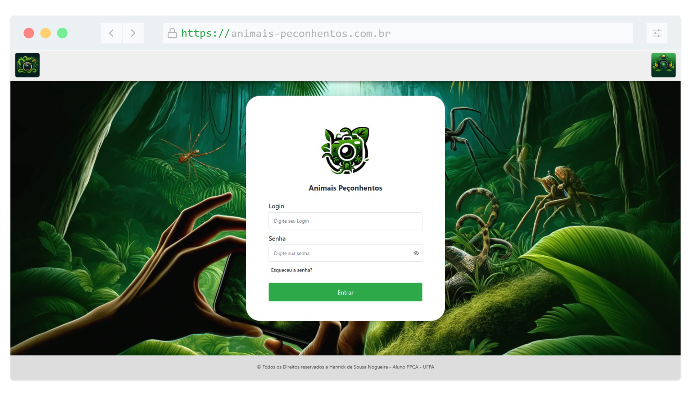
	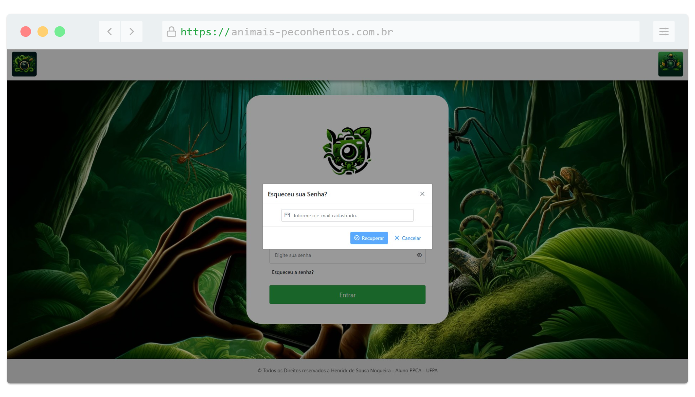
	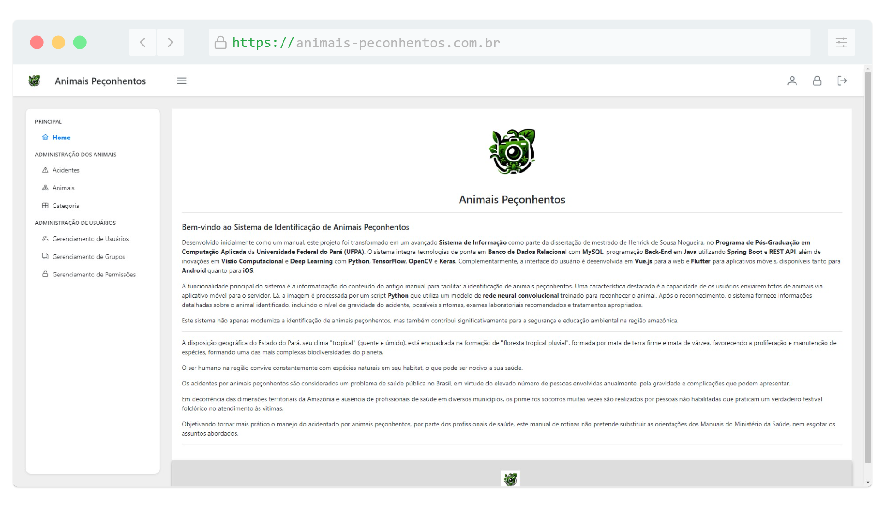
	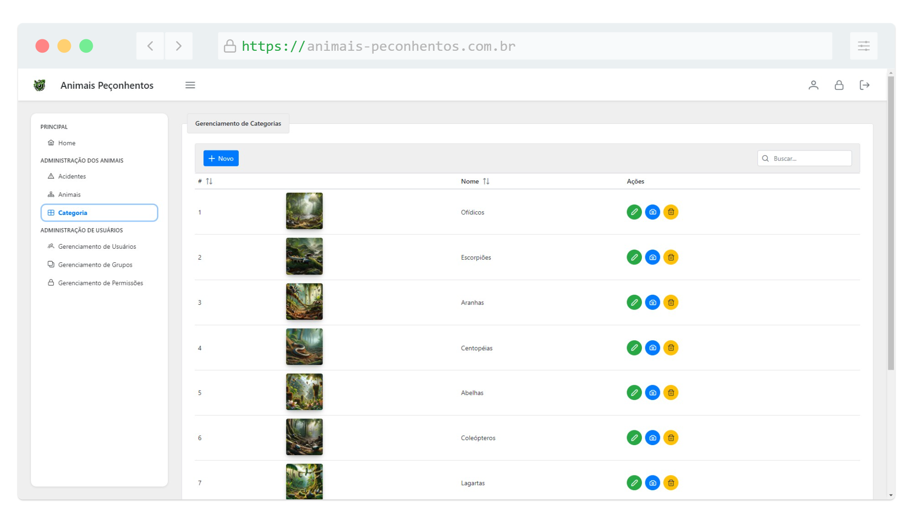
	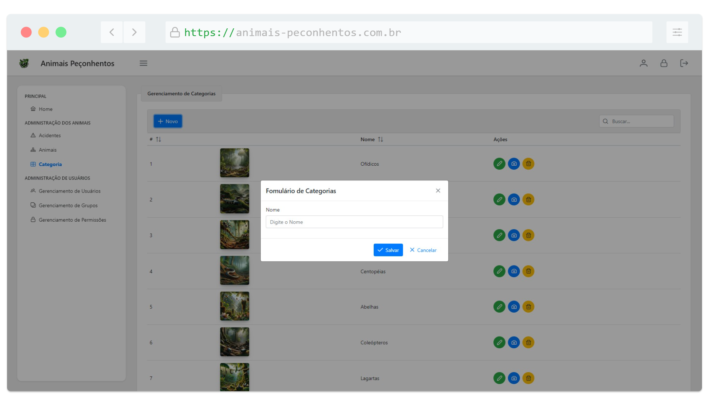
	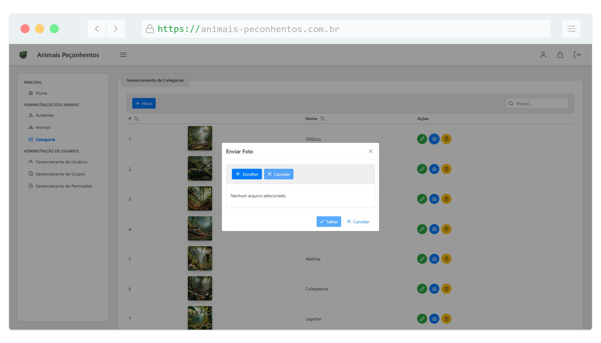
	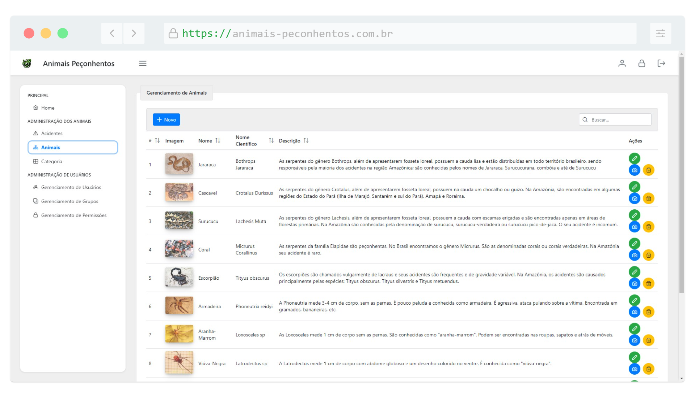
	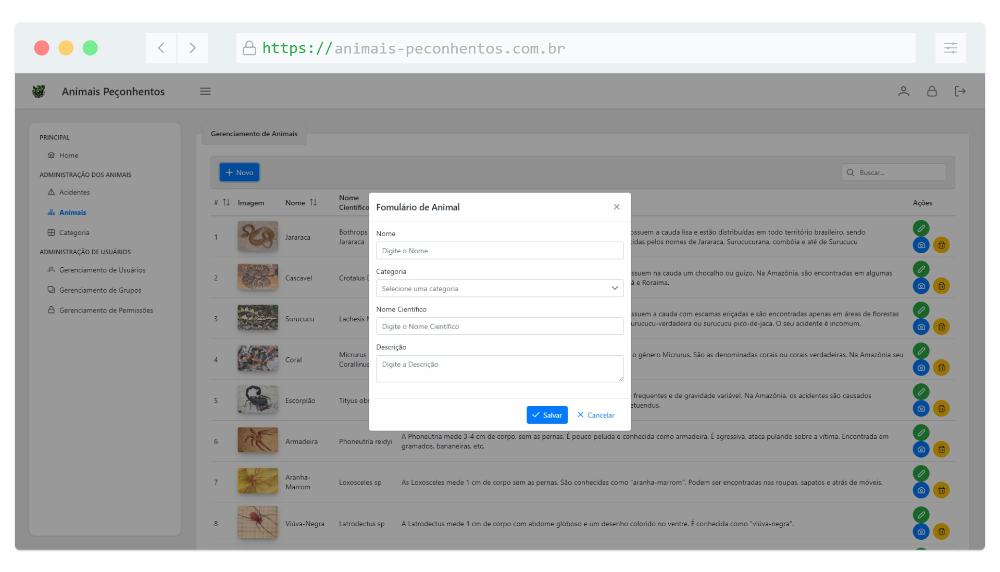
	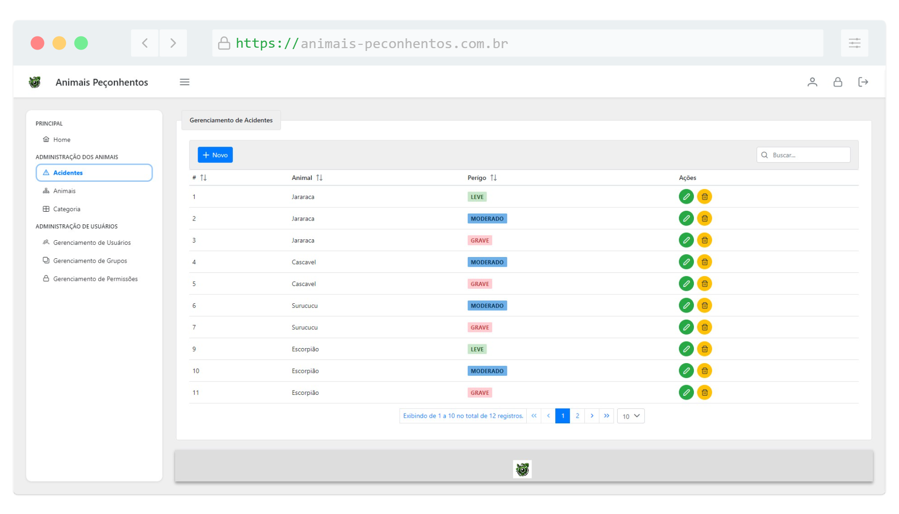 
	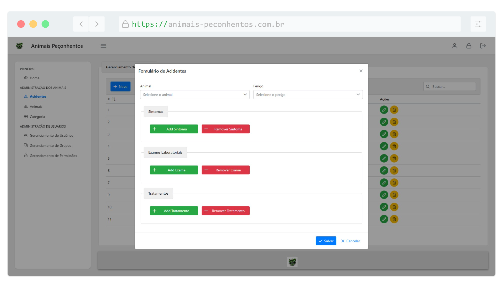 
	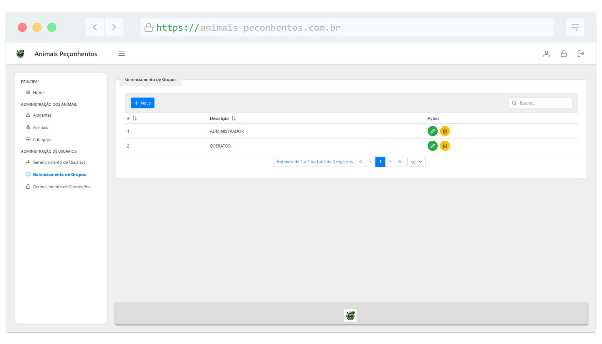
	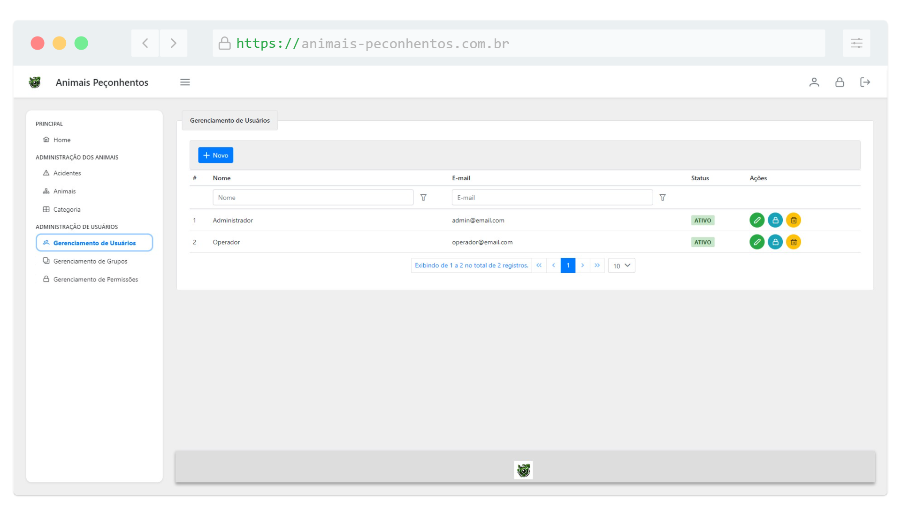
	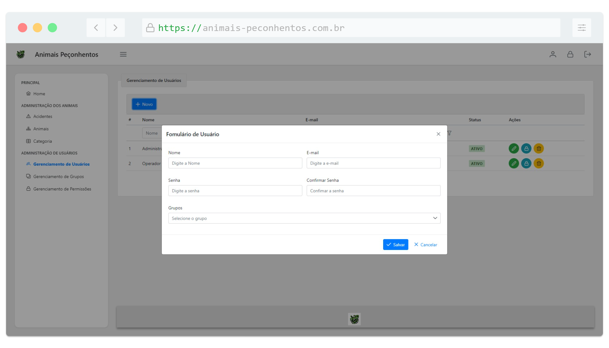
</p>
